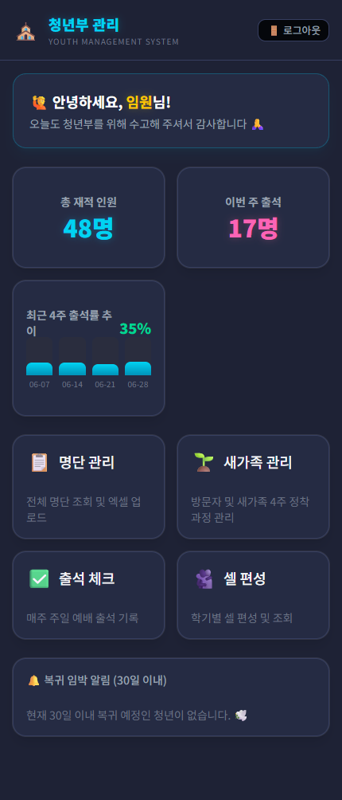
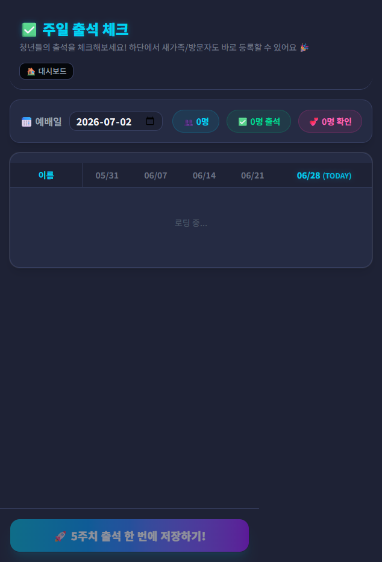
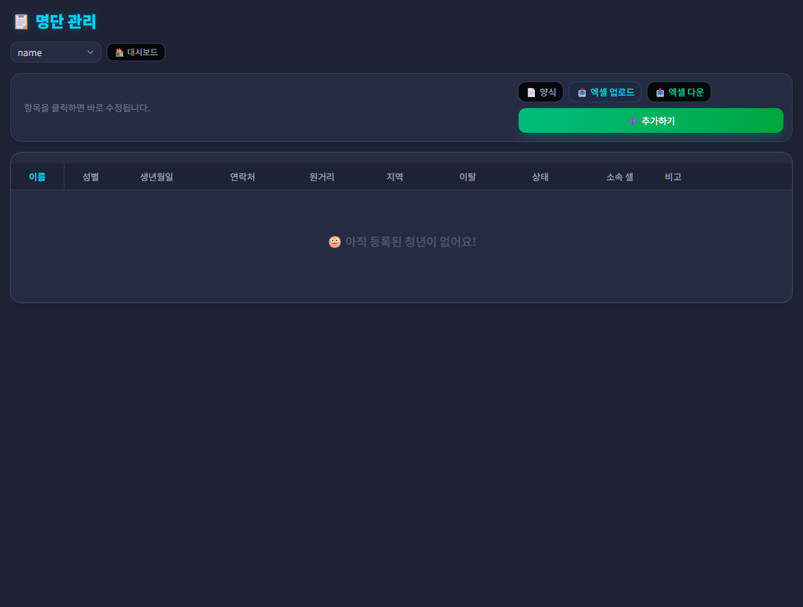

# 청년부 관리 시스템 - 임원 사용설명서

안녕하세요, 임원님! 시스템을 관리하고 청년부의 현황을 파악하는 핵심 기능을 안내해 드립니다.
임원용 비밀번호로 로그인하시면 다음과 같은 기능들을 사용할 수 있습니다.

## 1. 대시보드 (첫 화면)

로그인 후 처음 보이는 **대시보드** 화면입니다. 청년부 전체의 요약 정보를 한눈에 볼 수 있습니다.

  

- **최근 4주 출석률 추이**: 최근 한 달 동안의 전체 청년부 예배 출석률을 막대그래프로 보여줍니다.
- 주요 메뉴판: `출석 체크`, `명단 관리`, `셀 편성`, `새가족 관리` 버튼을 눌러 각 기능으로 이동할 수 있습니다.

## 2. 주일 출석 체크하기

예배 출석을 기록하는 메뉴입니다.

  

1. 좌측 상단에서 **기준일자(주일)**를 선택합니다.
2. 명단에서 해당 주일에 출석한 청년의 **체크박스**를 클릭합니다.
3. 명단에 없는 새가족이 방문했다면 하단 **[새가족 추가]** 칸에 이름을 적어줍니다.
4. 우측 상단의 초록색 **[저장하기]** 버튼을 반드시 눌러야 반영됩니다.

  <strong>🔥 꿀팁: 자동 상태 변경 기능</strong> 
  최근 5주를 기준으로 결석이 잦아지면(2회 이하 출석) 자동으로 명단의 색깔이 노란색(확인요망)으로 변합니다!

## 3. 명단 및 청년 상세 정보 관리

청년부 전체 명단을 관리하고, 개개인의 신상 정보와 출석 이력을 볼 수 있습니다.

  

1. **정보 수정**: 표에서 이름, 연락처, 생년월일 등을 클릭하면 **즉시 수정 모드**로 변합니다. 입력 후 엔터를 치면 즉시 저장됩니다!
2. **엑셀 다운로드**: 우측 상단의 `[📥 엑셀 다운]` 버튼을 누르면 전체 명단이 엑셀 파일로 컴퓨터에 저장됩니다.
3. **상세 프로필 보기**: 청년의 이름 쪽에 마우스를 올리면 조그만 **[프로필 ↗]** 버튼이 나타납니다. 거기로 들어가면 해당 청년의 역대 소속 셀 기록과 10주간 출석 기록을 한눈에 볼 수 있습니다.

수고에 깊이 감사드립니다!
